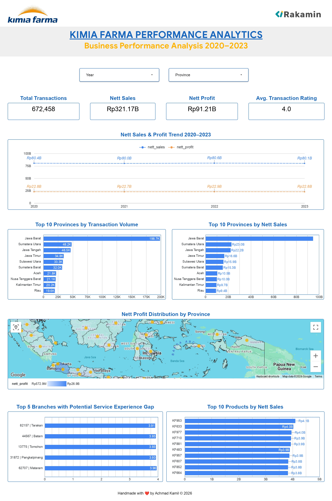

# Kimia Farma Big Data Analytics

## Analisis Performa Bisnis Kimia Farma 2020–2023

Project ini merupakan implementasi analisis data untuk Final Task Big Data Analyst Kimia Farma.

Saya menggunakan Google BigQuery untuk pengolahan dan analisis data dengan SQL, kemudian menggunakan Google Data Studio untuk menyajikan hasil analisis dalam bentuk dashboard interaktif.

Fokus analisis adalah memahami performa bisnis berdasarkan transaksi, nett sales, nett profit, wilayah, cabang, dan produk selama periode 2020–2023.

## Tujuan Analisis

Analisis ini dilakukan untuk menjawab beberapa pertanyaan bisnis berikut:

1. Bagaimana perkembangan performa bisnis selama 2020–2023?
2. Provinsi mana yang memiliki jumlah transaksi tertinggi?
3. Provinsi mana yang memberikan kontribusi nett sales terbesar?
4. Bagaimana distribusi nett profit antarprovinsi?
5. Cabang mana yang perlu mendapat perhatian lebih lanjut berdasarkan perbedaan rating?
6. Produk mana yang memberikan kontribusi nett sales terbesar?

## Alur Analisis

```text
Dataset Sumber
      |
      v
Google BigQuery
      |
      v
Pemeriksaan & Transformasi Data
      |
      v
kf_analysis
      |
      +---- SQL Analysis
      |
      v
Google Data Studio
      |
      v
Insight & Rekomendasi
```

## Proses Pengerjaan

1. Memahami struktur dan isi dataset sumber.
2. Melakukan pemeriksaan kualitas dan konsistensi data.
3. Memeriksa hubungan antara data transaksi dengan data master cabang dan produk.
4. Membuat tabel analisis `kf_analysis` di BigQuery.
5. Menerapkan business rules untuk menghitung nett sales dan nett profit.
6. Melakukan analisis berdasarkan periode, provinsi, cabang, dan produk.
7. Membuat dashboard interaktif menggunakan Google Data Studio.
8. Menyusun insight dan rekomendasi berdasarkan hasil analisis.

## Tabel Analisis

Tabel utama yang digunakan dalam analisis adalah:

`kimia_farma.kf_analysis`

Beberapa kolom utama yang digunakan:

- `transaction_id`
- `date`
- `year`
- `month`
- `branch_id`
- `branch_name`
- `kota`
- `provinsi`
- `rating_cabang`
- `customer_name`
- `product_id`
- `product_name`
- `product_category`
- `actual_price`
- `discount_percentage`
- `persentase_gross_laba`
- `nett_sales`
- `nett_profit`
- `rating_transaksi`

## Perhitungan Metrik

### Persentase Gross Laba

Persentase gross laba ditentukan berdasarkan harga produk:

| Actual Price | Persentase Gross Laba |
|---|---:|
| ≤ Rp50.000 | 10% |
| > Rp50.000 – Rp100.000 | 15% |
| > Rp100.000 – Rp300.000 | 20% |
| > Rp300.000 – Rp500.000 | 25% |
| > Rp500.000 | 30% |

### Nett Sales

Nett sales dihitung dengan mempertimbangkan harga produk dan diskon:

```text
nett_sales = actual_price × (1 - discount_percentage)
```

### Nett Profit

Nett profit dihitung berdasarkan nett sales dan persentase gross laba:

```text
nett_profit = nett_sales × persentase_gross_laba
```

## SQL Analysis

Query analisis disusun secara bertahap agar proses pengolahan dan analisis data lebih mudah ditelusuri.

| File | Keterangan |
|---|---|
| `01_data_quality.sql` | Pemeriksaan kualitas dan konsistensi data |
| `02_create_analysis_table.sql` | Pembuatan tabel `kf_analysis` |
| `03_yearly_performance.sql` | Analisis performa tahunan dan bulanan |
| `04_province_analysis.sql` | Analisis performa berdasarkan provinsi |
| `05_branch_analysis.sql` | Analisis performa cabang dan rating |
| `06_product_analysis.sql` | Analisis performa produk |

Setiap script diberi komentar untuk menjelaskan tujuan dan logika query yang digunakan.

## Catatan Data Inventory

Data inventory tidak digunakan sebagai direct join terhadap data transaksi karena satu kombinasi `branch_id` dan `product_id` dapat memiliki lebih dari satu record inventory.

Penggabungan langsung berpotensi menyebabkan row multiplication sehingga nilai transaksi, nett sales, dan nett profit dapat terhitung lebih dari satu kali.

Oleh karena itu, analisis utama menggunakan data transaksi yang digabungkan dengan master cabang dan master produk.

## Dashboard

Dashboard dibuat menggunakan Google Data Studio untuk menyajikan hasil analisis secara interaktif.

Dashboard mencakup:

- Total Transactions
- Nett Sales
- Nett Profit
- Average Transaction Rating
- Tren Nett Sales dan Nett Profit 2020–2023
- 10 Provinsi dengan transaksi tertinggi
- 10 Provinsi dengan nett sales tertinggi
- Distribusi nett profit berdasarkan provinsi
- Analisis cabang
- 10 Produk dengan nett sales tertinggi

### Dashboard Preview



## Insight Utama

### 1. Pertumbuhan Penjualan Relatif Datar

Nett sales berada pada kisaran Rp80 miliar per tahun selama 2020–2023. Perubahan year-over-year relatif kecil, yaitu sekitar -0,50% pada 2021, +0,68% pada 2022, dan -0,57% pada 2023.

Hal ini menunjukkan bahwa performa penjualan selama periode analisis cenderung stabil dan belum menunjukkan pertumbuhan yang konsisten.

### 2. Kontribusi Regional Masih Terkonsentrasi

Jawa Barat merupakan provinsi dengan volume transaksi dan nett sales tertinggi. Provinsi ini menyumbang sekitar 29,6% dari total transaksi selama periode 2020–2023.

Kondisi ini menunjukkan adanya konsentrasi aktivitas bisnis yang cukup besar pada wilayah Jawa Barat.

### 3. Transaksi dan Nett Sales Memiliki Pola Regional yang Sejalan

Provinsi dengan volume transaksi tinggi pada umumnya juga memiliki kontribusi nett sales yang tinggi.

Hal ini menunjukkan adanya pola yang relatif sejalan antara aktivitas transaksi dan kontribusi penjualan pada tingkat provinsi.

### 4. Beberapa Cabang Layak Ditinjau Lebih Lanjut

Terdapat cabang dengan rating cabang relatif tinggi tetapi rata-rata rating transaksi lebih rendah.

Perbedaan tersebut digunakan sebagai indikator screening awal untuk menentukan cabang yang memerlukan investigasi lebih lanjut, bukan sebagai bukti hubungan sebab-akibat.

### 5. Kontribusi Produk Tersebar

Beberapa produk dengan nett sales tertinggi memiliki kontribusi yang relatif berdekatan.

Hal ini menunjukkan bahwa performa penjualan tidak hanya bergantung pada satu produk, sehingga pemantauan portofolio produk tetap penting.

## Rekomendasi

### Strategi Regional

Mempertahankan performa wilayah dengan kontribusi tinggi sekaligus mencari peluang pertumbuhan di wilayah lain untuk mengurangi konsentrasi kontribusi bisnis.

### Strategi Produk

Memantau produk dengan nett sales tinggi dan mengevaluasi peluang optimasi promosi, harga, serta ketersediaan produk.

### Pengalaman Pelanggan

Melakukan pemeriksaan lebih lanjut terhadap cabang yang menunjukkan perbedaan antara rating cabang dan rating transaksi untuk memahami kemungkinan area perbaikan layanan.

## Tools

- Google BigQuery
- SQL
- Google Data Studio
- GitHub

## Struktur Repository

```text
kimia-farma-big-data-analytics/
├── README.md
├── .gitignore
├── dashboard/
│   └── Kimia_Farma_Performance_Analytics_Dashboard.jpg
├── docs/
│   └── methodology.md
└── sql/
    ├── 01_data_quality.sql
    ├── 02_create_analysis_table.sql
    ├── 03_yearly_performance.sql
    ├── 04_province_analysis.sql
    ├── 05_branch_analysis.sql
    └── 06_product_analysis.sql
```

## Tentang Project

Project ini dibuat sebagai bagian dari pembelajaran dan Final Task Big Data Analyst.

Proses pengerjaan mencakup pemeriksaan kualitas data, penggabungan data transaksi dengan data master, pembuatan metrik bisnis, analisis menggunakan SQL, visualisasi melalui dashboard, serta penyusunan insight dan rekomendasi.

## Author

**Handmade with ❤️ by Achmad Kamil © 2026**

## Disclaimer

Project ini dibuat untuk keperluan pembelajaran dan portfolio berdasarkan dataset yang disediakan pada Final Task Big Data Analyst Kimia Farma.

Hasil analisis bukan merupakan laporan resmi Kimia Farma dan digunakan untuk tujuan edukasi serta demonstrasi proses analisis data.